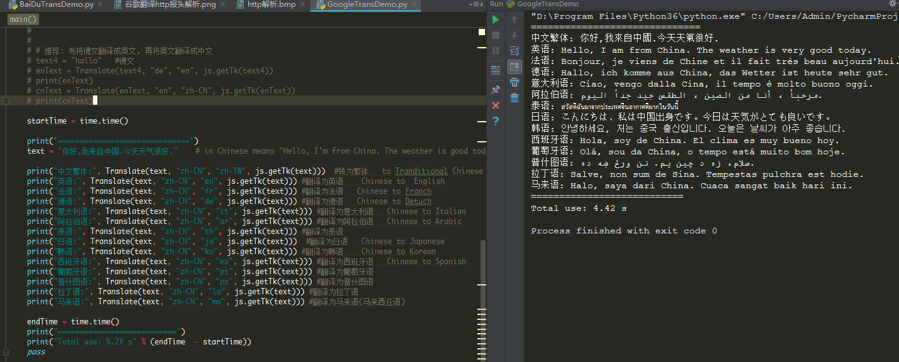

# TranslateTool

## 说明 (Descriptions)

- 使用谷歌翻译(Use google translate. )
- 支持全世界100多种语言间翻译(Supporting translation of more than 100 languages across the world.)
- 你可以自定义功能(You can custom the functions.)
- 提供了自动语种识别接口(An automatic language recognition interface is provided.)
- 提供了百度翻译接口(Baidu translation interface is provided.)

## 效果(result)

